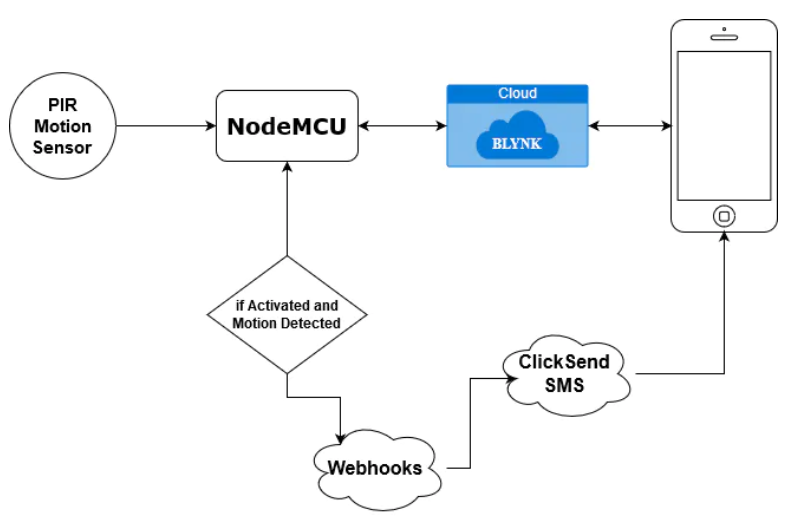
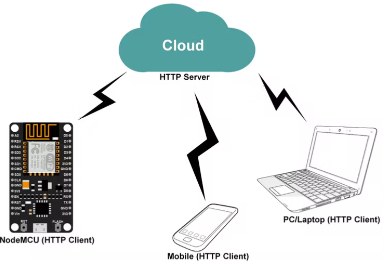
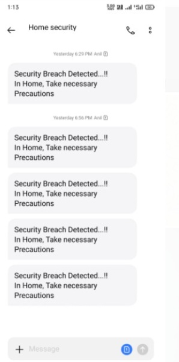

# IOT Theft Detection

This project is about the development of an Internet of Things (IoT) based smart wireless home security system, which sends an alert on intrusion. A PIR sensor is used to detect the motion of any human being in its vicinity. NODE MCU ESP8266 is used to connect the system to internet through Wi-Fi. Whenever a movement is detected by the PIR sensor, a message is sent to a smart phone by the NODE MCU. 

## Components Required:

- PIR Motion Sensor
- NODE MCU
- Bread board
- Jumper wires

## Software apps and online services

- Blynk
- Arduino IDE
- IFTT Webhooks

## How does it work?

As you know, the NodeMCU is a WiFi-enabled microcontroller, Which can connect to the internet via WiFi. So, using the BLYNK Blynk application, we can activate the device. For this purpose, we connected the button with the virtual pin, so that when the activate button is pressed, the value in the variable "state" will change from "1" to "0" (Refer code).

In the next step, if the "state" is 1, the PIR Sensor starts to check for the intruders. So, whenever an intruder (ie, motion) is detected, the sensor will send a HIGH value to the NodeMCU. When NodeMCU reads a HIGH value, an HTTP request will be sent from the NodeMCU. This HTTP request (WebHooks API) will trigger ClickSend SMS Service, thus we receive the SMS in our Phone as soon as the Motion is Detected.

HTTP (Hypertext Transfer Protocol) is a standard Application protocol that functions as a request-response protocol between client and server.

HTTP client helps to send HTTP requests and receive HTTP responses from HTTP server.

It is widely used in IoT based embedded applications like Home Automation, vehicle engine parameter monitoring remotely for analysis, etc.

## Communication Flow

## Configuring Blynk App :

If This Then That, also known as IFTTT, is a freeware web-based service that creates chains of simple conditional statements, called applets. An applet is triggered by changes that occur within other web services such as Gmail, Facebook, Telegram, Instagram, or Pinterest. We are Configuring or SMS feature through this Linking Platform.

First of all, open the IFTTT website by clicking HERE. Sign in with your Google account. Then create a new applet. To create a new applet, Click on the Account Icon at the top right corner (Near Explore) and click create. Now click on This and search for WebHooks. Click on Connect. A new window will be loaded with a blue-colored box containing "Recieve a web Request". Click on the box. Now you will be asked to provide EVENT NAME. Type ESP_MOTION in the box and press "Create trigger".

Now click on that and search for SMS and select ClickSend SMS. This feature will send SMS to the configured mobile number. Click on Connect and create a new account, then close the newly opened window, and press the Connect Button again and login with the account and authorize. Now fill the form with required Details. First Field is the Recipient Mobile Number, the second field is the Sender details, which can be a name or a number (doesn't really matter), and the third box is the Message body, you can customize it as you like.

And finally, click the Create Action Button.
## Whenever a movement is detected, the Alarm will turn on.

